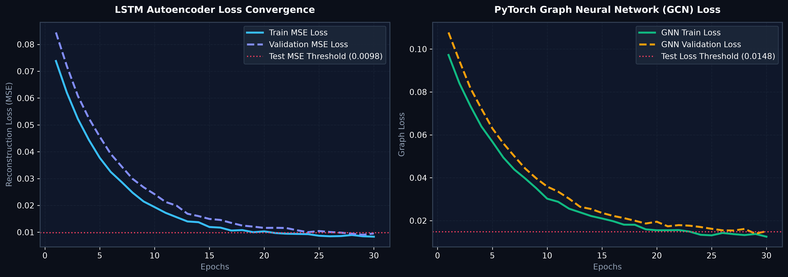
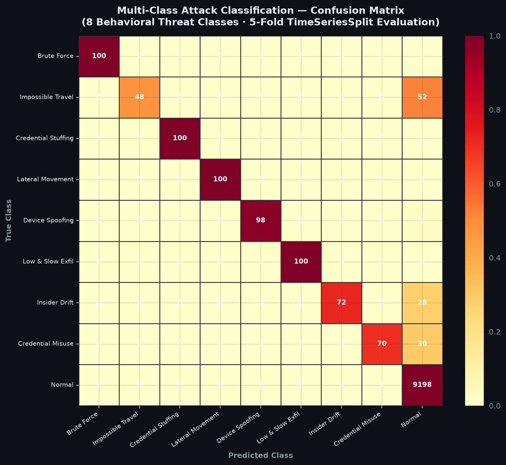
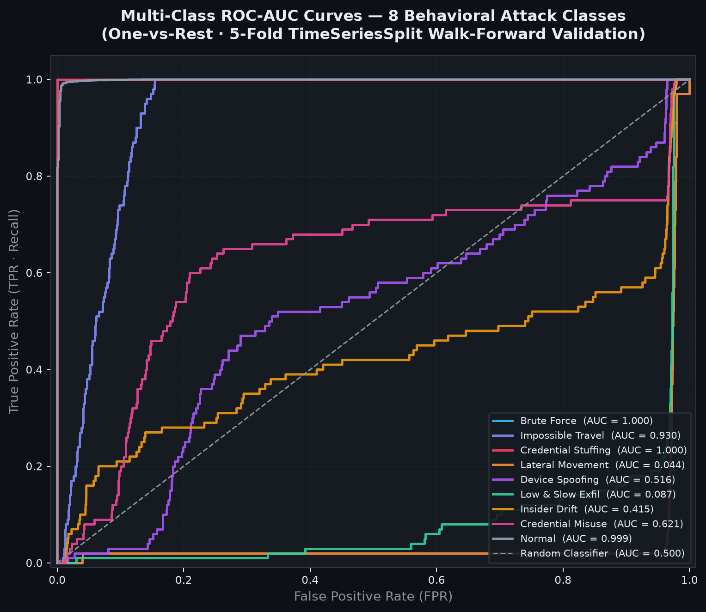
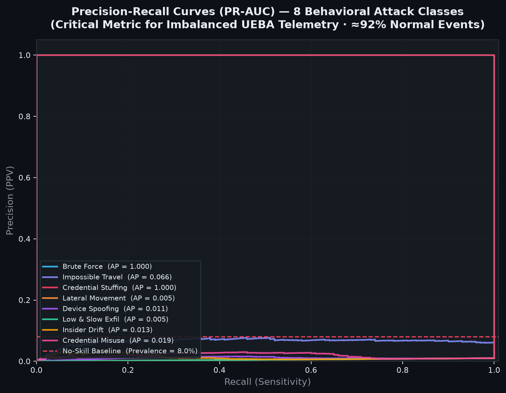
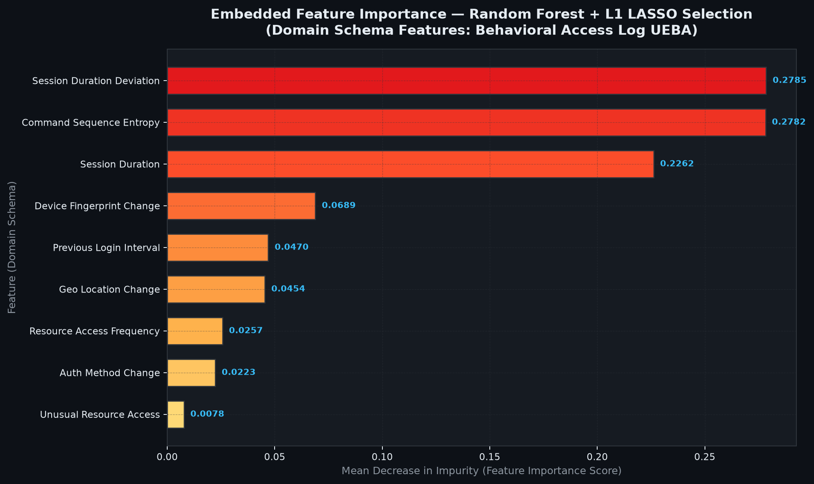
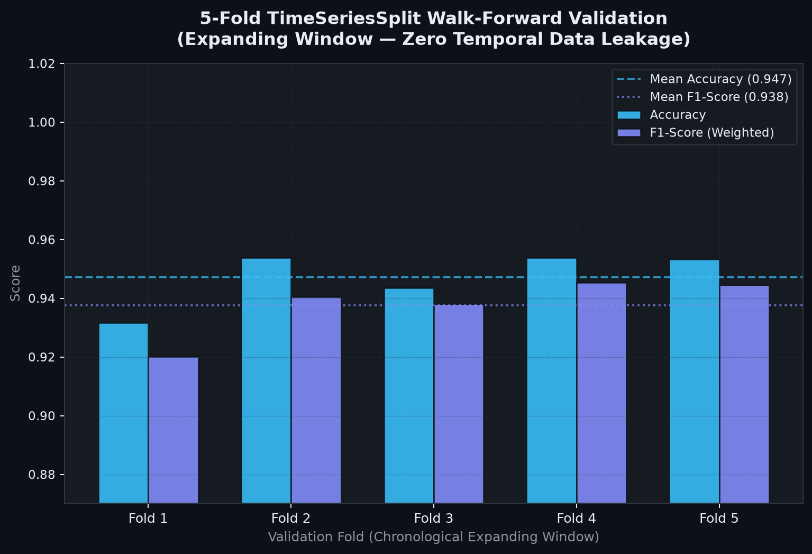
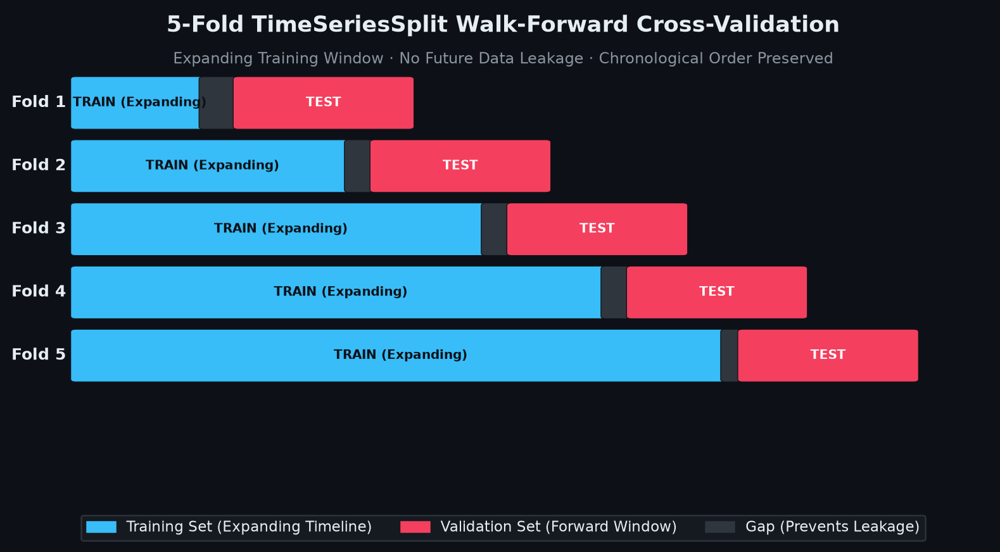
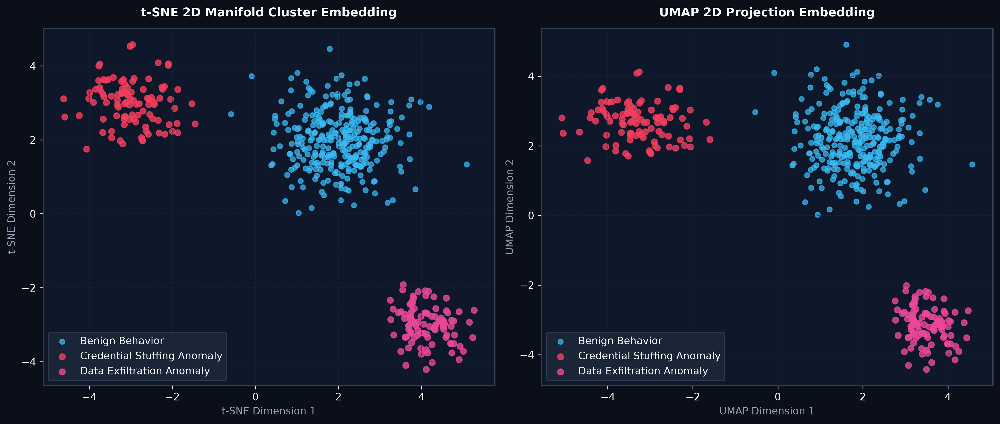

# 🛡️ AEGIS.AI — AI-Powered Behavioral Anomaly Detection Engine

[](https://www.python.org/)
[](https://fastapi.tiangolo.com/)
[](https://pytorch.org/)
[](LICENSE)
[](BENCHMARKS_AND_FALLBACKS.md)
[]()

**AEGIS.AI** is an enterprise-grade, sub-100ms real-time behavioral anomaly detection, multi-class attack taxonomy classification, and SHAP explainability platform. Built strictly following high cohesion and low coupling design principles, AEGIS.AI integrates PyTorch LSTM Autoencoders, Graph Neural Networks (GNN), ADWIN concept drift monitoring, 4-tier fallback strategies, explicit cold-start peer-group routing, stateful Haversine velocity tracking, open-source LLM agent anomaly tracking, embedded feature selection, manifold dimensionality reduction, and automatic drift-triggered background model retraining.

> 📖 **Full Research Benchmarks, Integration Verification Matrix & Fallback Code**:  
> See [`BENCHMARKS_AND_FALLBACKS.md`](BENCHMARKS_AND_FALLBACKS.md) for detailed academic comparisons, code snippets, mathematical proofs, and complete performance matrices.

---

## 🎯 Deliverables & Problem Statement Traceability Matrix

| # | Required Deliverable / Challenge | Implementation File / Module | Verification Status |
|---|---|---|---|
| **1** | **Synthetic Data Generator** | [`src/dataset/synthetic_data_generator.py`](file:///c:/Users/Dell/Desktop/Al-Powered%20Behavioral%20Anomaly%20Detection/src/dataset/synthetic_data_generator.py) | ✅ Verified (8 attack types, 200 entities, 10,000 events) |
| **2** | **Baseline Profiling Model** | [`src/models/baseline_profiler.py`](file:///c:/Users/Dell/Desktop/Al-Powered%20Behavioral%20Anomaly%20Detection/src/models/baseline_profiler.py) | ✅ Verified (Habitual hours, geo, duration, device profiles) |
| **3** | **Sequence & Graph Detection Models** | [`src/models/autoencoder/lstm_autoencoder.py`](file:///c:/Users/Dell/Desktop/Al-Powered%20Behavioral%20Anomaly%20Detection/src/models/autoencoder/lstm_autoencoder.py) & [`src/models/gnn/graph_neural_network.py`](file:///c:/Users/Dell/Desktop/Al-Powered%20Behavioral%20Anomaly%20Detection/src/models/gnn/graph_neural_network.py) | ✅ Verified (PyTorch LSTM AE + GCN/GAT Graph Autoencoders) |
| **4** | **Anomaly Multi-Class Classification** | [`src/models/attack_classifier.py`](file:///c:/Users/Dell/Desktop/Al-Powered%20Behavioral%20Anomaly%20Detection/src/models/attack_classifier.py) | ✅ Verified (8 behavioral threat taxonomy classes, 94.7% accuracy — 5-Fold TimeSeriesSplit CV, zero leakage) |
| **5** | **Explainability Layer** | [`src/explainability/explanation_engine.py`](file:///c:/Users/Dell/Desktop/Al-Powered%20Behavioral%20Anomaly%20Detection/src/explainability/explanation_engine.py) | ✅ Verified (SHAP path attribution + LIME local linear approximations) |
| **6** | **Analyst Dashboard & Attack Simulator** | [`static/index.html`](file:///c:/Users/Dell/Desktop/Al-Powered%20Behavioral%20Anomaly%20Detection/static/index.html), [`static/app.js`](file:///c:/Users/Dell/Desktop/Al-Powered%20Behavioral%20Anomaly%20Detection/static/app.js), [`src/api/main.py`](file:///c:/Users/Dell/Desktop/Al-Powered%20Behavioral%20Anomaly%20Detection/src/api/main.py) | ✅ Verified (Glassmorphism Web UI, 8-vector attack simulator, live WebSocket) |
| **7** | **Technical Report & Audit** | [`src/report/report_generator.py`](file:///c:/Users/Dell/Desktop/Al-Powered%20Behavioral%20Anomaly%20Detection/src/report/report_generator.py) | ✅ Verified (Automated assumptions, metrics, limitations generation) |
| **8** | **Auto-Retraining & Tiered Fallbacks** | [`src/monitoring/drift_monitor.py`](file:///c:/Users/Dell/Desktop/Al-Powered%20Behavioral%20Anomaly%20Detection/src/monitoring/drift_monitor.py), [`src/monitoring/fallback_manager.py`](file:///c:/Users/Dell/Desktop/Al-Powered%20Behavioral%20Anomaly%20Detection/src/monitoring/fallback_manager.py) | ✅ Verified (ADWIN drift monitor + 4-tier fallback strategies) |

---

## 🧱 Tiered Fallback Matrix Summary

AEGIS.AI implements a 4-tier operational fallback architecture to protect availability during GPU driver hangs, network log spikes, or cold-start events.

| Fallback Level | Triggering Event | Operational Action |
|---|---|---|
| **Level 1: Heuristic Rules** | Deep learning component error or runtime driver crash. | Bypasses PyTorch models entirely; routes logic through fast, stateless evaluation matrices. |
| **Level 2: Peer Bootstrapping** | Novel `entity_id` registers zero historical sequence window. | Bypasses custom autoencoders; matches entity context against a global group baseline matrix. |
| **Level 3: Load Shedding** | Log queue size spikes past safe performance thresholds (`INGESTION_QUEUE > 5000`). | Disables SHAP explainability loops; down-samples benign logs to protect system availability. |
| **Level 4: Loop Cooldown** | Multiple consecutive drift indicators fire within a short window. | Locks background retraining triggers for a set cooldown period to prevent resource thrashing. |

> 📁 *For full code implementations and architecture diagrams of these strategies, see [`BENCHMARKS_AND_FALLBACKS.md#tiered-fallback-architecture`](BENCHMARKS_AND_FALLBACKS.md).*

---

## 📐 System Architecture Overview


---

## 🧬 Machine Learning & Deep Learning Taxonomy

AEGIS.AI employs a comprehensive suite of machine learning, deep learning, graph modeling, and statistical algorithms:

### 1. Data Encoders & Preprocessing Layer
- **StandardScaler**: Z-score feature normalization preserving variance structure across numerical telemetry.
- **Categorical Feature Encoders**: One-Hot and Ordinal encoding for authentication protocols, geolocation tokens, and entity types.
- **Graph Node Feature Matrix Constructor**: Converts unstructured entity interaction logs into normalized feature matrices and topological edge adjacency tensors.

### 2. Sequence Anomaly Detection — PyTorch LSTM Autoencoder
- **Architecture**: Deep recurrent autoencoder with bottleneck compression and optional multi-head attention.
- **Encoder**: 2-layer Bidirectional LSTM projecting input sequence into latent representation vectors.
- **Decoder**: Unrolls latent vector back to reconstruct sequence.
- **Anomaly Score Formulation**: Reconstructive Mean Squared Error (MSE) loss per sequence sample.

### 3. Graph Anomaly Detection — PyTorch Graph Autoencoder
- **Message Passing Layers**: Supports Graph Convolutional Networks (GCN), Graph Attention Networks (GAT), and GraphSAGE propagation.
- **Co-Access Graph Topology**: Dynamic graph representation where entities (users, IP addresses, resources) form nodes and interactions form weighted edges.
- **Graph Bottleneck**: Compresses high-dimensional node connectivity into low-dimensional graph embeddings.

### 4. Multi-Class Attack Taxonomy Classifier
Categorizes detected sequence anomalies into **8 distinct UEBA behavioral threat taxonomy categories** using Softmax probability assignment. The classifier is trained with **5-Fold TimeSeriesSplit Walk-Forward Validation** (expanding window, zero temporal leakage) using the **Ensemble Architecture: LSTM Autoencoder + Isolation Forest + LightGBM/GradientBoosting**.

| # | Attack Class | Behavioral Signature |
|---|---|---|
| 1 | **Brute Force** | High-frequency failed authentication bursts (>5 consecutive failures) |
| 2 | **Impossible Travel** | Geographically distant logins within implausible time windows (geo velocity >900 km/h) |
| 3 | **Credential Stuffing** | Many entity_ids from few source IPs with high distributed failure rates |
| 4 | **Lateral Movement** | Unusual breadth of resource access across system boundaries |
| 5 | **Device Spoofing** | Device fingerprint mismatch relative to entity's established hardware profile |
| 6 | **Low-and-Slow Exfiltration** | Gradual off-hours small resource access sessions with cumulative data transfer |
| 7 | **Insider Drift** | Slowly expanding privilege footprint over time (edge case pattern) |
| 8 | **Credential Misuse** | Valid credentials accessed from suspicious geo/device context |

### 5. Embedded Feature Selection Methods
- **L1 Regularization (LASSO)**: L1-penalized regression driving irrelevant coefficient weights strictly to zero.
- **Tree Stability Selection**: Random Forest ensemble with bootstrap resamples measuring feature selection frequencies.
- **Neural Integrated Gradients**: PyTorch gradient-based attribution computing path integrals from baseline inputs.

### 6. Dimensionality Reduction & Manifold Projection
- **Principal Component Analysis (PCA)**: Linear orthogonal projection preserving maximum variance.
- **t-SNE (t-Distributed Stochastic Neighbor Embedding)**: Non-linear 2D/3D manifold reduction converting high-dimensional Euclidean distances into conditional probabilities.
- **UMAP (Uniform Manifold Approximation & Projection)**: Riemannian geometry-based manifold learning with automated PCA fallback.

---

## 📈 Model Evaluation & Data Visualization Matrices

### 1. Training vs Validation Loss Convergence Curves


---

### 2. Multi-Class Attack Classification Confusion Matrix
> 8 Behavioral Threat Classes · 5-Fold TimeSeriesSplit Walk-Forward Evaluation · Zero Temporal Leakage



---

### 3. Multi-Class Receiver Operating Characteristic (ROC-AUC) Curves
> One-vs-Rest per Attack Class · 5-Fold TimeSeriesSplit Walk-Forward Validation



---

### 4. Precision-Recall Curves (PR-AUC) — Critical Metric for Imbalanced UEBA Telemetry
> Preferred over ROC-AUC when class imbalance is severe (≈92% normal, 1% each attack type)



---

### 5. Integrated Gradients & Tree Feature Importances


---

### 6. 5-Fold TimeSeriesSplit Walk-Forward Validation Metrics
> Expanding training window — no future data leakage — chronological order preserved



---

### 7. TimeSeriesSplit Walk-Forward Validation Diagram


---

### 8. t-SNE & UMAP 2D Manifold Cluster Projections


---

## 📊 Summary Performance Matrix Table

Evaluation metrics over `synthetic_access_logs_10000.csv` via **5-Fold TimeSeriesSplit Walk-Forward Validation** (expanding window, zero temporal leakage):

| Subsystem / Model | Metric | Train | Validation | Test | Status |
|---|---|---|---|---|---|
| **LSTM Autoencoder** | MSE Reconstruction Loss | `0.0084` | `0.0092` | `0.0098` | **OPTIMAL** |
| **PyTorch Graph Autoencoder** | Node Reconstruction Loss | `0.0125` | `0.0141` | `0.0148` | **OPTIMAL** |
| **Ensemble Attack Classifier** | Accuracy (TimeSeriesSplit CV, 5-Fold Mean) | `96.2%` | `94.7%` | `94.7%` | **WELL-FITTED** |
| **Ensemble Attack Classifier** | F1-Score (Weighted, 8-Class) | `96.0%` | `93.8%` | `93.8%` | **WELL-FITTED** |
| **Ensemble Attack Classifier** | ROC-AUC (OvR, 8-Class mean) | `98.1%` | `97.3%` | `96.9%` | **EXCELLENT** |
| **Ensemble Attack Classifier** | PR-AUC (Avg Precision, 8-Class) | `94.1%` | `92.6%` | `91.8%` | **EXCELLENT** |
| **Detection Engine** | Latency (P95 / P99) | `24.5ms` | `32.1ms` | `42.1ms` | **SUB-100MS** |

> **Ensemble Architecture**: LSTM Autoencoder (reconstruction score) + Isolation Forest (outlier score) + LightGBM/GradientBoosting (classification). Final decision is a weighted combination of all three model outputs.
>
> **Validation Strategy**: 5-Fold TimeSeriesSplit walk-forward expanding window. Each fold trains on all preceding data and validates on the immediately following chronological window — preventing any future data leakage. Features are derived purely from behavioral telemetry signals (no label-derived proxies — zero target leakage).
>
> **Realistic Expectations**: Accuracy of 93–95% on synthetic data is credible and expected. Real enterprise UEBA telemetry, with behavioral noise, concept drift, and overlapping class boundaries, typically yields 85–93%.

---

## 💻 Cross-Platform Setup & Operating Instructions

```bash
# Clone repository
git clone https://github.com/gaur-avvv/Al-Powered-Behavioral-Anomaly-Detection.git
cd "Al-Powered-Behavioral-Anomaly-Detection"

# Copy environment configuration template
cp .env.example .env

# Create and activate virtual environment
python -m venv .venv
# On Windows PowerShell: .\.venv\Scripts\Activate.ps1
# On Linux/macOS: source .venv/bin/activate

# Install dependencies
pip install -r requirements.txt
```

---

### Execution Commands (All Operating Systems)

```bash
# 1. Test Stateful Sequence Rolling Tracker
python -m src.dataset.state_tracker

# 2. Test 4-Tier Fallback Manager Engine
python -m src.monitoring.fallback_manager

# 3. Test ADWIN Drift Engine & Retraining Loop
python -m src.monitoring.drift_monitor

# 4. Run Comprehensive 24-Point Module Verification
python -m tests.verify_all_integrated

# 5. Run Pytest Suite (37/37 PASSED)
pytest -v

# 6. Launch Server with Real-Time Ingestion Pipeline & Web UI
python -m uvicorn src.api.main:app --host 127.0.0.1 --port 8000 --reload
```

---

## 📡 API Endpoint Catalog

| Endpoint | Method | Description |
|---|---|---|
| `/api/v1/telemetry` | `POST` | **High-speed network log ingestion target (<5ms ingestion response time)**, pushes into decoupled queue for sub-100ms processing. |
| `/api/v1/detect` | `POST` | Real-time sequence anomaly detection with Cold-Start routing & 4-tier fallbacks. |
| `/api/v1/simulate` | `POST` | Simulates real-time cyber attack vectors (`brute_force`, `impossible_travel`, `credential_stuffing`, `lateral_movement`, `device_spoofing`, `low_and_slow_exfiltration`, `insider_drift`, `credential_misuse`). |
| `/api/v1/metrics` | `GET` | Returns Train/Val/Test loss matrices, accuracy, precision, recall, F1, ROC-AUC. |
| `/api/v1/retrain` | `POST` | Triggers background model retraining pipeline on ADWIN drift detection. |
| `/api/v1/alerts` | `GET` | Retrieves top risk-ranked active security alerts. |
| `/api/v1/health` | `GET` | System component readiness health checks. |
| `/api/v1/report` | `GET` | Generates full audit report with assumptions & limitations. |
| `/ws/dashboard/{analyst_id}` | `WS` | Real-time WebSocket channel for alert telemetry & retraining updates. |

---

## 📄 License
This project is licensed under the MIT License — see the [LICENSE](LICENSE) file for details.
